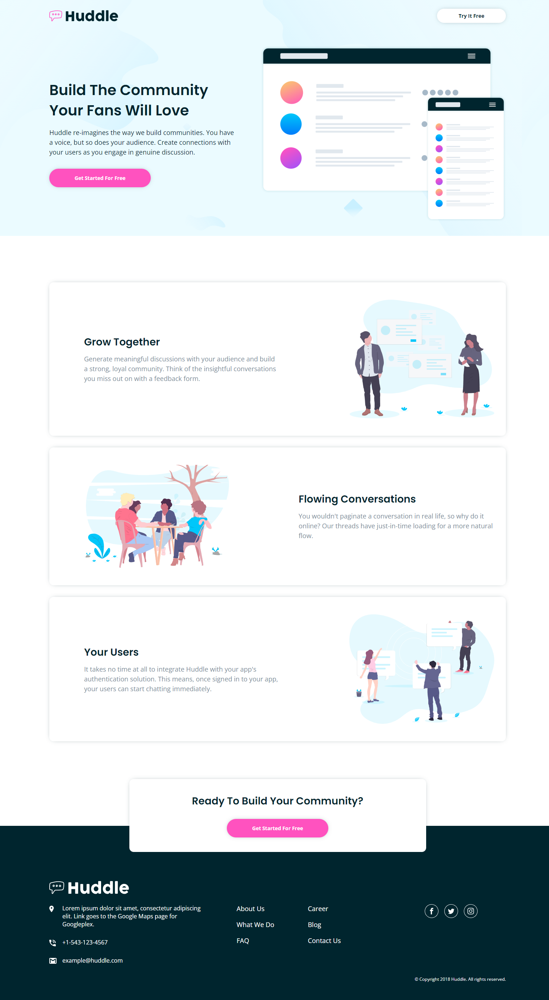

# Frontend Mentor - Huddle landing page with alternating feature blocks solution

This is a solution to the [Huddle landing page with alternating feature blocks challenge on Frontend Mentor](https://www.frontendmentor.io/challenges/huddle-landing-page-with-alternating-feature-blocks-5ca5f5981e82137ec91a5100). Frontend Mentor challenges help you improve your coding skills by building realistic projects. 

## Table of contents

- [Overview](#overview)
  - [The challenge](#the-challenge)
  - [Screenshot](#screenshot)
  - [Links](#links)
- [My process](#my-process)
  - [Built with](#built-with)
  - [What I learned](#what-i-learned)
- [Author](#author)

## Overview
- A responsive landing page built with HTML and CSS

### The challenge
- Build out this landing page and get it looking as close to the design as possible

### Screenshot

### Links
- Live Site URL: https://clinquant-cocada-00d2d1.netlify.app

## My process
- Utilized various *flexbox* properties to achieve the desired responsiveness and to match the design spec
- Used a *container* class to set the max-width of the different sections, allowing for full-width backgrounds
- Used a mobile-first approach to writing CSS
- Used *CSS Grid* within the *footer* to achieve the desired layout
- Adjusted *flexbox* and *CSS Grid* properties within media queries to adapt the website to larger device sizes
 

### Built with
- Semantic HTML5 markup
- CSS custom properties
- CSS Flexbox
- CSS Grid
- Mobile-first approach to CSS

### What I learned
- How to approach a larger project with unique sections on a single page
- Practiced writing HTML that logically separates the different sections on the page and utilizes classes (*container*) to share behavior between different sections
- Continued practice with writing mobile-first CSS
- Adjusting *flexbox* and *CSS Grid* properties for larger device sizes to match the provided design spec

## Author
- Ryan Hemrick